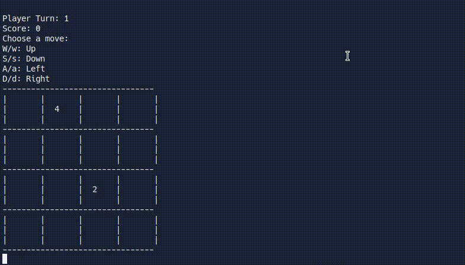

# 2048 Console App

[Clone on replit](https://replit.com/@andrewxychen/2048-Text?v=1) | [View in Github](https://github.com/aaachen/2048-Text)

This is a post-AP exam project I created for the AP CS A students while volunteering for [TEALs](https://www.microsoft.com/en-us/teals)

I find it a nice way to introduce some important software engineering concepts to students (utility methods, algorithmic thinking, modular code and pattern, testing, etc.). Hope you find this useful as an instructor!

## What's inside

1. Template for students to implement the game (`Board.java` class)
1. Worksheets and other instructional material for project checkpoints and hints
1. Unit tests to verify checkpoint progress

## Edit the worksheets

Source materials are created in [Obsidian](https://obsidian.md/) using the [Excalidraw plugin](https://github.com/zsviczian/obsidian-excalidraw-plugin). Source files are located in the `obsidian` folder for edit

